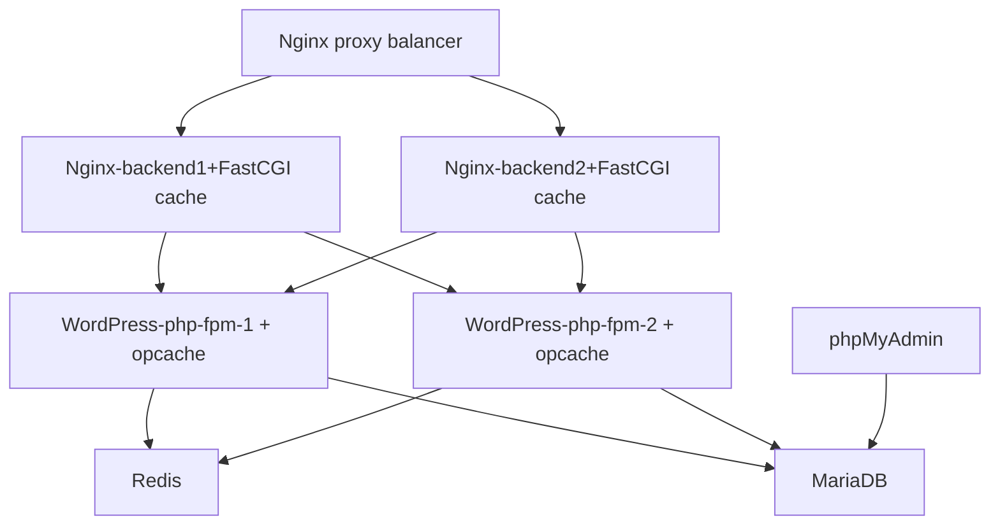

## Пример создания тестовой среды для разработки на WordPress. Docker-compose

### Стек технологий:
* Nginx (proxy): 1.23.1
* Nginx (2 backends): 1.23.1
* MariaDB: 10.6.11
* WordPress (2 app): 6.1.1-php8.2-fpm
* Redis: 5.0.7-alpine
* phpMyAdmin: Latest

**Redis** — сетевое журналируемое хранилище данных типа "ключ" — "значение" с открытым исходным кодом.
При загрузке страницы необходимый SQL-запрос извлекается из памяти Redis; благодаря этому база данных не 
перегружается дублируемыми запросами. В результате страница загружается значительно быстрее, а влияние
сервера на ресурсы базы данных уменьшается. Если поступивший запрос не обнаружен в памяти Redis,
он извлекается из базы данных, после чего добавляется в кэш-память Redis.

**Opcache** - его главная задача — единожды скомпилировать каждый PHP-скрипт 
и закэшировать получившиеся опкоды в общую память, чтобы их мог считать и
выполнить каждый рабочий процесс PHP

## Как работает балансировщик ?
Создается безопасный маршрут от браузера клиента, проходящий через балансировщик нагрузки, до внутреннего сервера. В Nginx использована директива "HTTP" для HTTP запросов и директива "stream" для SSL запросов. Директива stream фактически позволяет внутреннему серверу завершать входящие соединения и в то же время балансировать нагрузку.

## Схема работы балансировщика

## Основные настройки для проксирования 
1. Включена опция proxy_protocol на балансировщике.
2. Добавлена опция real_ip_header proxy_protocol и set_real_ip_from proxy на бэкэнд веб серверах.
3. Установлена опция proxy_protocol в директиве listen на бэкэндах.

## Директива set_real_ip_from *proxy* на бэкэндах
 Директива set_real_ip_from со значением *proxy*. proxy - это имя хоста прокси-сервиса, которое благодаря внутреннему механизму DNS Docker преобразуется в IP-адрес. Таким образом, мы можем гарантировать, что даже при перезапуске балансировщика нагрузки внутренние серверы получат правильный IP (docker делает это сам и правильно). Наконец, стоит упомянуть, что протокол прокси был разработан для создания цепочки обратных прокси без потери информации о клиенте.

## Порядок установки:

> **Для корректной работы измените переменную окружения PUBLIC_IP в файле .env на IP адрес вашего компьютера:**
> * Добавьте в файл hosts имя домена example.com, а также www.example.com и соответствующий ему IP адрес:
> * <IP адрес вашего компьютера> example.com
> * <IP адрес вашего компьютера> www.example.com

## Установка Docker

## Запуск контейнеров с помощью docker-compose

