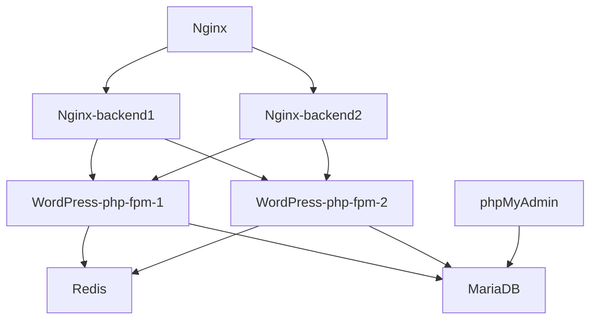

## Пример создания тестовой среды для разработки на WordPress

### Стек технологий:
* Nginx (proxy): 1.23.1
* Nginx (2 backends): 1.23.1
* MariaDB: 10.6.11
* WordPress (2 app): 6.1.1-php8.2-fpm
* Redis: 5.0.7-alpine
* phpMyAdmin: Latest

**Redis** — сетевое журналируемое хранилище данных типа "ключ" — "значение" с открытым исходным кодом.
При загрузке страницы необходимый SQL-запрос извлекается из памяти Redis; благодаря этому база данных не 
перегружается дублируемыми запросами. В результате страница загружается значительно быстрее, а влияние
сервера на ресурсы базы данных уменьшается. Если поступивший запрос не обнаружен в памяти Redis,
он извлекается из базы данных, после чего добавляется в кэш-память Redis.

**Opcache** - его главная задача — единожды скомпилировать каждый PHP-скрипт 
и закэшировать получившиеся опкоды в общую память, чтобы их мог считать и
выполнить каждый рабочий процесс PHP

## Схема работы

